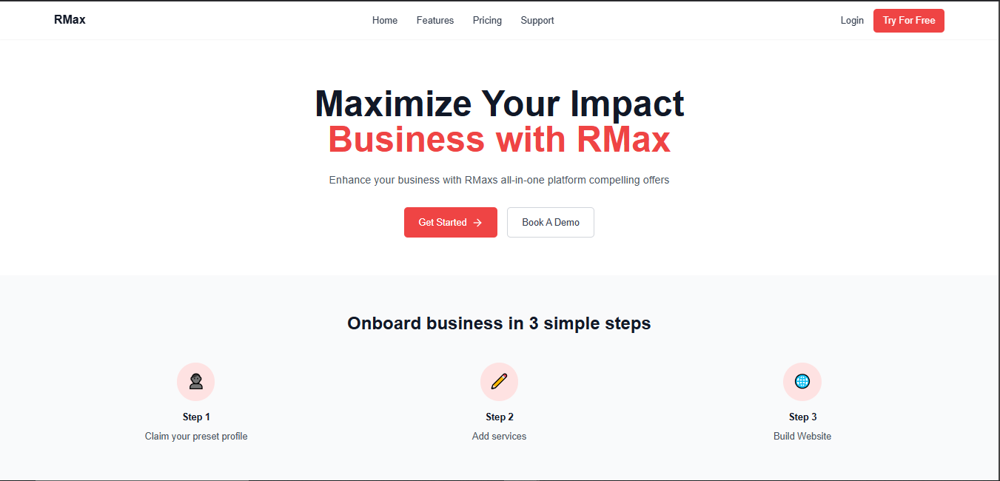
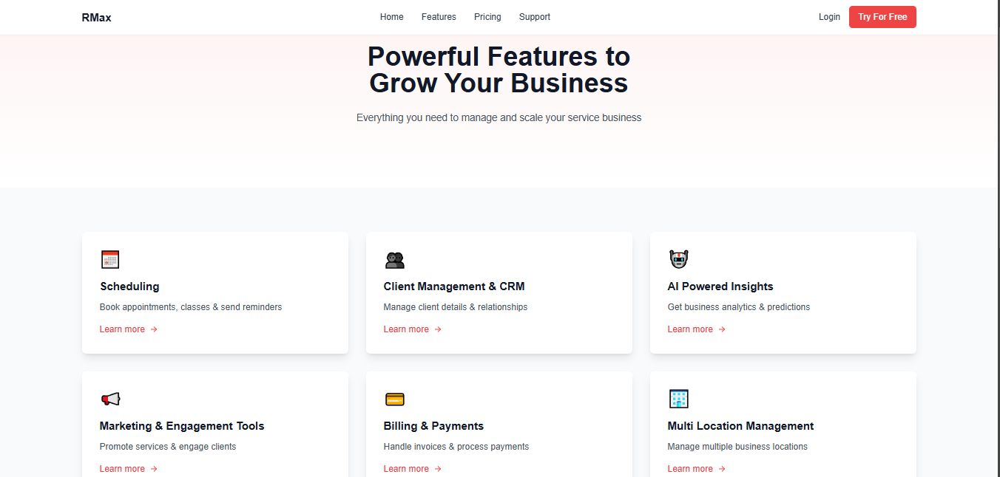
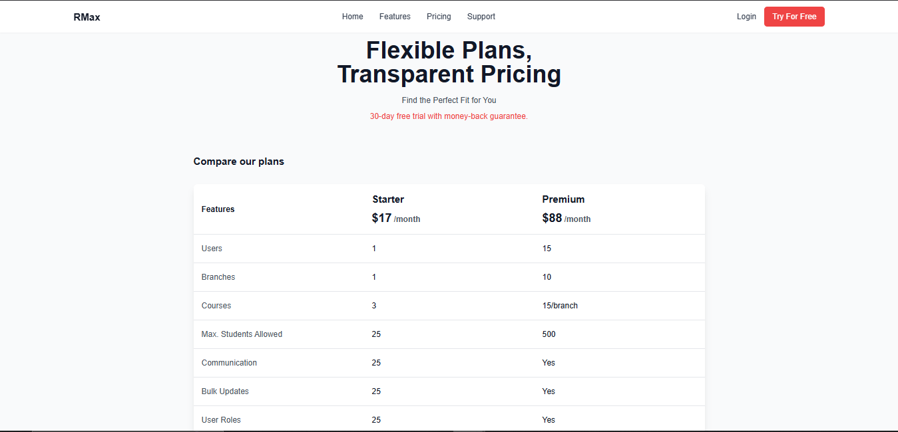
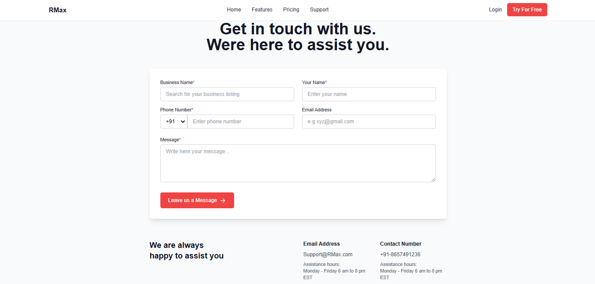

# RMax - Business Management Platform 🚀

A modern, responsive business management platform built with React, Vite, and Tailwind CSS.

## 🌟 Live Demo

live demo: [RMax Platform]()

## 🛠️ Technologies Used

- **Frontend Framework:** React 18
- **Build Tool:** Vite
- **Styling:** Tailwind CSS
- **Icons:** Lucide React
- **Routing:** React Router DOM
- **UI Components:** Headless UI
- **Code Quality:** ESLint

## 📸 Screenshots

### Landing Page


### Features Page


### Pricing Page


### Support Page


## 🚀 Getting Started

1. **Clone the repository**
   ```bash
   git clone https://github.com/MohammedJawwad/qest_assessment.git
   cd qest_assessment
   ```

2. **Install dependencies**
   ```bash
   npm install
   ```

3. **Start development server**
   ```bash
   npm run dev
   ```

4. **Build for production**
   ```bash
   npm run build
   ```

## 📦 Project Structure

```
rmax/
├── src/
│   ├── assets/
│   ├── components/
│   │   ├── Footer.jsx
│   │   └── Header.jsx
│   ├── pages/
│   │   ├── LandingPage.jsx
│   │   ├── FeaturesPage.jsx
│   │   ├── PricingPage.jsx
│   │   └── SupportPage.jsx
│   ├── App.css
│   ├── index.css
│   └── App.jsx
├── public/
├── package.json
├── vite.config.js
├── tailwind.config.js
└── README.md
```

## ✨ Key Features

- 🎨 Modern and Clean UI Design
- 📱 Fully Responsive Layout
- 🚀 Optimized Performance
- ♿ Accessibility Focused
- 🌐 SEO Friendly Structure
- 📦 Component-Based Architecture

 
**Jawwad**
- MyWebsite: [Portfolio](https://mohammedjawwad.netlify.app/)
- LinkedIn: [Mohammed Jawwad](https://www.linkedin.com/in/mohammedjawwad/)
---

Built with ❤️ using React + Vite + Tailwind CSS - Jawwad
